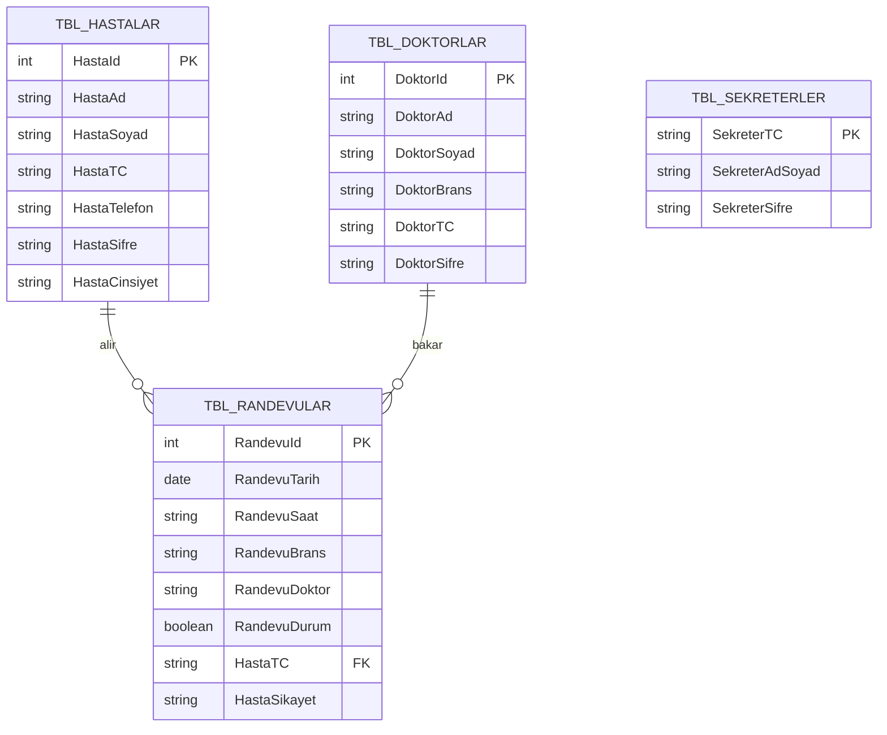
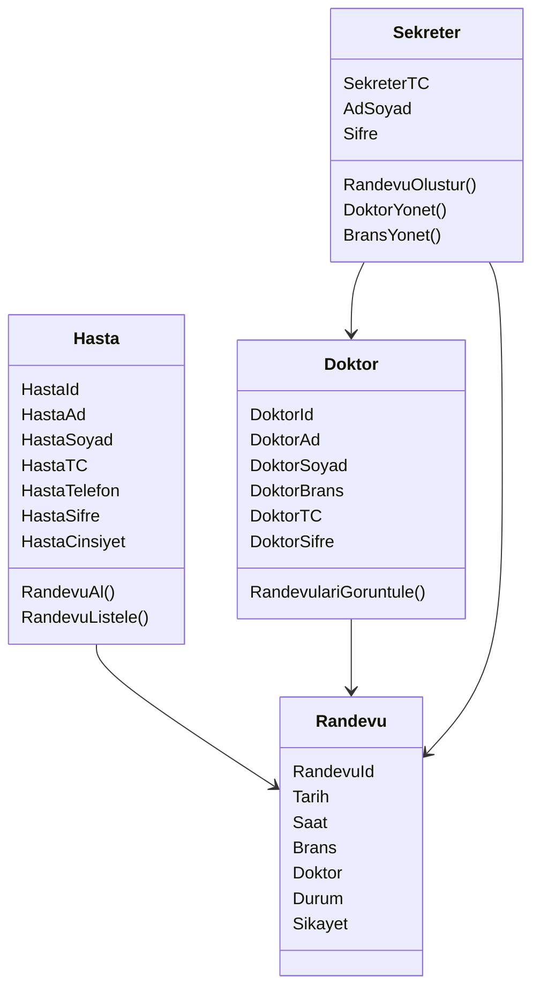

# 🏥 Hospital Appointment Management System | Hastane Randevu Otomasyon Sistemi

---

## 🇹🇷 Türkçe Açıklama

### 📌 Proje Hakkında

Bu proje, **C# .NET Windows Forms ve SQL Server kullanılarak geliştirilmiş rol tabanlı bir hastane randevu otomasyon sistemidir.**

Sistem hasta, doktor ve sekreter olmak üzere üç farklı kullanıcı rolü içerir ve her rol için ayrı işlem panelleri sunar. Kullanıcılar TC kimlik numarası ve şifre ile giriş yaparak sistem üzerinde işlem gerçekleştirebilir.

Bu proje gerçek dünya hastane sistemlerinin çalışma mantığını modellemek amacıyla geliştirilmiştir.

---

### 🎯 Sistem Özellikleri

✅ Rol tabanlı giriş sistemi (Hasta / Doktor / Sekreter)
✅ TC ve şifre ile kimlik doğrulama
✅ Randevu oluşturma ve yönetimi
✅ Doktor ve branş yönetimi
✅ SQL Server veritabanı entegrasyonu
✅ CRUD işlemleri (Ekle / Güncelle / Sil / Listele)
✅ Çok panelli Windows Forms mimarisi
✅ Gerçek zamanlı veri güncelleme

---

### 👥 Kullanıcı Rolleri

#### 👤 Hasta Paneli

* Randevu alma
* Randevu geçmişi görüntüleme
* Branş ve doktor listeleme
* Kişisel bilgileri görüntüleme

#### 🩺 Doktor Paneli

* Kendisine ait randevuları görüntüleme
* Hasta bilgilerini inceleme
* Randevu detaylarını görüntüleme

#### 🧾 Sekreter Paneli

* Randevu oluşturma
* Doktor ekleme / güncelleme
* Branş yönetimi
* Duyuru oluşturma
* Sistem yönetimi

---

### 🛠️ Kullanılan Teknolojiler

* C# (.NET Framework)
* Windows Forms
* SQL Server
* ADO.NET
* Object-Oriented Programming

---

### 🗄️ Veritabanı Tabloları

* Hastalar
* Doktorlar
* Sekreterler
* Randevular
* Branşlar

---

## 🇬🇧 English Description

### 📌 Overview

This project is a **role-based hospital appointment management system** developed using **C# .NET Windows Forms and SQL Server**.

The system includes three different user roles (Patient, Doctor, Secretary) and provides separate interfaces for each role. Users authenticate using ID number and password.

The project simulates real-world hospital workflow and database-driven system design.

---

### 🎯 Features

✅ Role-based login system
✅ Authentication with ID and password
✅ Appointment scheduling and management
✅ Doctor and department management
✅ SQL Server integration
✅ Full CRUD operations
✅ Multi-panel Windows Forms architecture
✅ Real-time database updates

---

### 👥 User Roles

#### Patient Panel

* Book appointments
* View appointment history
* View doctors and departments

#### Doctor Panel

* View assigned appointments
* Access patient information

#### Secretary Panel (Admin)

* Create appointments
* Manage doctors
* Manage departments
* System operations

---

## 🏗️ System Architecture

* Presentation Layer → Windows Forms UI
* Business Logic Layer → Appointment management
* Data Access Layer → SQL Server / ADO.NET

---

## ▶️ Installation

1. Clone repository
2. Create SQL database
3. Update connection string
4. Run project in Visual Studio

---

## 🗄️ Database ER Diagram

## 🏗️ System UML Diagram

## 👩‍💻 Developer

Yelda Battı
Information Systems Engineering Student
Sakarya University
